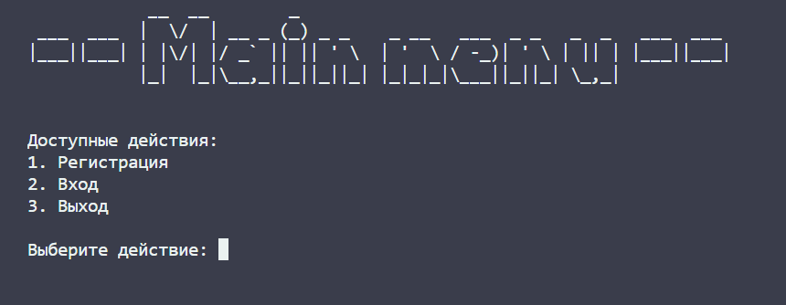
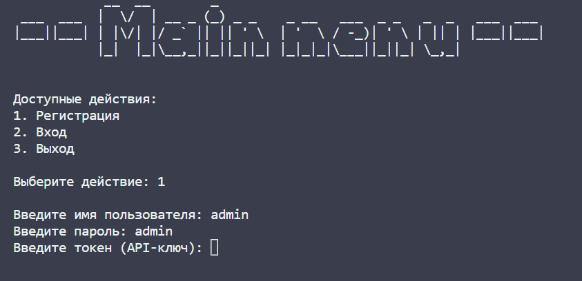
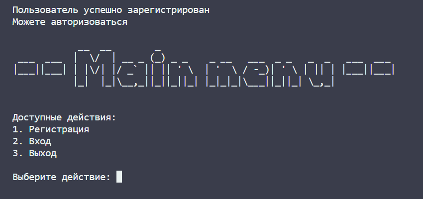
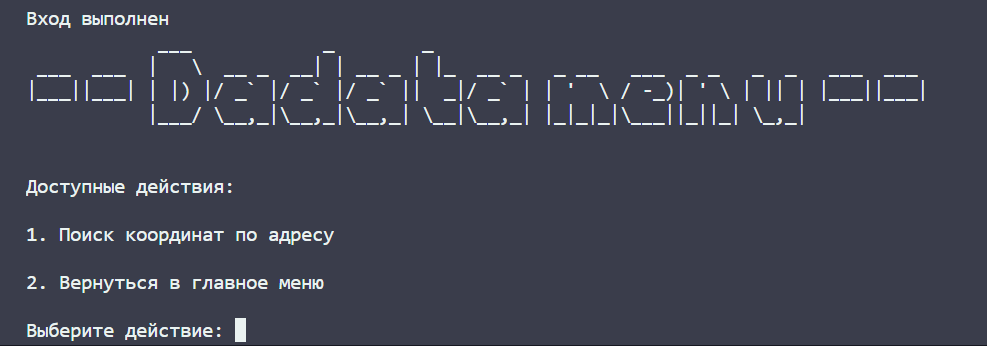
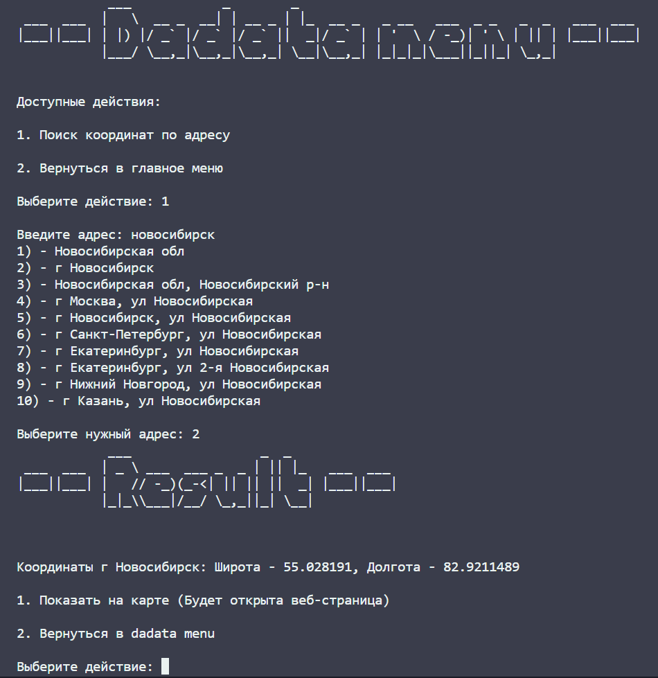
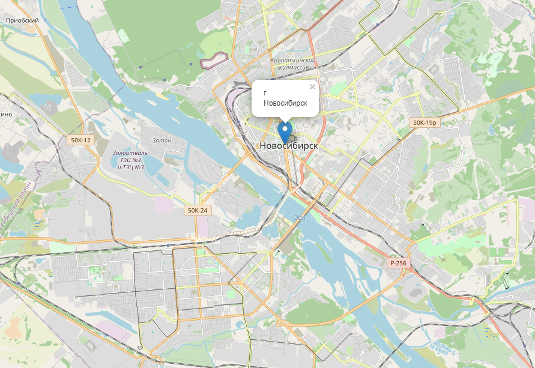

# Test task for CARBIS 
In this application you can find an adress latitude and longitude.

[](https://wakatime.com/badge/user/499e43e9-6f16-4377-92ae-078c74517dbb/project/57866a4f-9fd0-461f-8759-46b39c476b8f.svg)

# Screenshots
After the application is started, you can see main menu.

For using the application, you need register an account with the credentials.

After registration, you can see the main menu again and now you can login.

After login, you can see the dadata menu and now you can find the address.

If entry is not found, you can see the error message. But if you enter the correct address, you can see some choices of the address. 

When you choose the address, you can see the map with the point of the address.



Testing project.

In this project I use:
```
sqllite3
dadata
folium
art
```

## Deployment local
1. Clone repository 
```
git clone https://github.com/diplodoc13/Test_task_for_carbis.git
cd Test_task_for_carbis
```
2. Create a virtual environment and activate it:
```
python -m venv venv
source venv/Scripts/activate 
```
3. Install the dependencies:
```
pip install -r requirements.txt
```


4. Run the application:
```
py .\app.py
```


## Contact the author
>[LinkedIn](http://linkedin.com/in/maxim-usanin/)

>[Telegram](https://t.me/m5286606)

>[Portfolio](https://github.com/diplodoc13)
